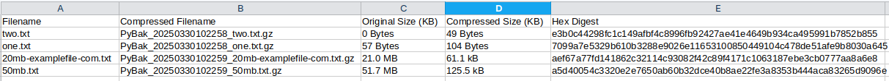

# PyArchive - Automated File Archival using Python

## Overview
This project automates file compression, archival, logging, and reporting. It ensures that duplicate files are not processed using a hash-based mechanism and integrates email notifications for status updates.

## Features
- **File Compression**: Compresses files using GZIP and moves them to a destination folder.
- **Duplicate Handling**: Uses SQLite to check file hashes and skips duplicates.
- **Logging**: Captures all events, errors, and processes in a log file.
- **Email Notifications**: Sends an email with an attached report after processing.
- **Reports**: Generates reports summarizing processed files.
- **Automated Testing**: Includes `pytest` for unit testing.

## Tech Stack
- **Python** (Core programming language)
- **SQLite** (Database for tracking processed files)
- **shutil** (File compression)
- **smtplib** (Email handling)
- **Logging Module** (For maintaining logs)
- **pytest** (For testing)

## Directory Structure
```
📂 Automated-File-Archival-using-Python
├── 📂 data		       # Directory where SQLite db file will be stored
├── 📂 destination             # Compressed files are moved here
├── 📂 log                     # Stores log files
├── 📂 scipts		       # Scripts that are used
├── 📂 source	               # Directory where unprocessed files arrive
├── 📂 test_data               # Directory where pytest will generate test data
├── 📂 test                    # Pytest code implemented
├── 📂 reports                 # Stores generated reports
├── 📜 main.py      	       # Main script handling file processing
├── 📜 README.md               # Project Documentation
├── 📜 requirements.txt        # Python modules required
```

## Workflow
1. **File Arrival**: A new file is placed in `source_dir`.
2. **Hash Check**: The script checks if the file is already processed using a hash stored in SQLite.
3. **Compression**: If the file is new, it is compressed using GZIP and moved to `destination_dir`.
4. **Logging**: The process details are logged.
5. **Reports Generation**: A summary report is created.
6. **Email Notification**: A report of processed files is emailed.

## Email Notification Example
```



```

## Setup & Usage
### 1. Clone the repository
```bash
git clone https://github.com/aniket-dataeng/PyArchive.git
cd PyArchive
```

### 2. Install dependencies
```bash
pip install -r requirements.txt
```

### 3. Configure Environment Variables
Set up email credentials for notifications:
```bash
export EMAIL_USER='your_email@gmail.com'
export EMAIL_PASS='your_app_password'
```

### 4. Run the script
```bash
python main.py
```

## 5. Testing
Run tests using:
```bash
pytest
```

## 📌 Future Enhancements
- **S3 Integration**: Move compressed files to AWS S3.
- **Multi-threading**: Improve performance for high file volume.
- **Web Dashboard**: Visualize reports using a web interface.

